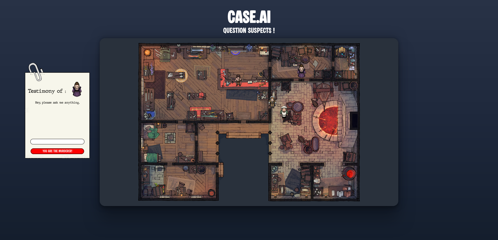
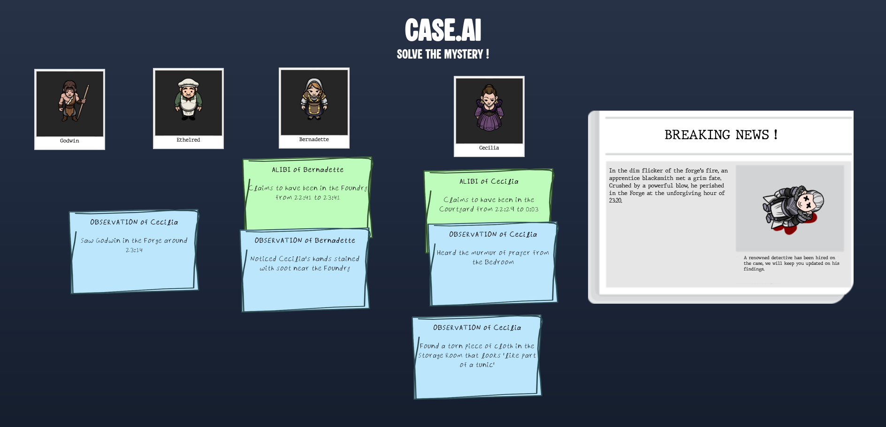

# CaseAI

**An AI-generated murder mystery game.**  

Investigate procedurally created cases, interrogate suspects powered by language models, and solve the crime before Watson — a symbolic AI.

## Project Overview

CaseAI is a browser-based investigation game where each playthrough generates a new murder scenario:
- The weapon, motive, timeline, and characters are created procedurally.
- Characters are LLM-driven agents with short-term memory, capable of natural language dialogue.
- Clues are automatically collected on a **clue board** as players interact with suspects.
- A symbolic AI detective, **Watson**, powered by [tau-prolog](https://github.com/tau-prolog/tau-prolog), competes with you to solve the mystery using the same evidence.

The game runs entirely client-side as a static web application, hosted on [GitHub Pages](https://hpn4.github.io/CaseAI).  
It requires an **OpenAI API key** to function.

## How to Play

1. [Open the game](https://hpn4.github.io/CaseAI).  
2. Enter your OpenAI API key.  
3. Explore the smithy map, click on suspects, and start conversations.  
4. Collect evidence.  
5. Deduce the culprit before Watson does.

## Tech Stack

- **Frontend:** HTML, CSS, JavaScript  
- **LLM Agents:** OpenAI API (GPT-4o)  
- **Symbolic AI:** tau-prolog  
- **Hosting:** GitHub Pages  
- **Storage:** Local JSON objects
